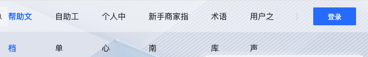
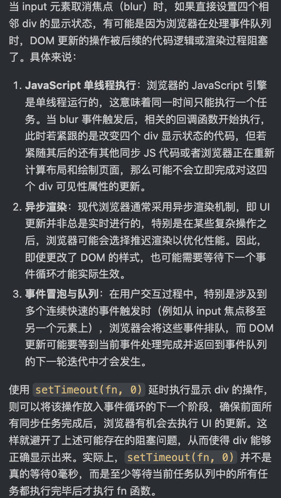

# 项目疑难点记录

### [帮助文档项目链接](https://helpcenter.zcygov.cn/document/#/document/dashboard?siteCode=beijing)

### 2024-03

- 顶部导航栏因为小屏，导致 tab 栏的位置不足，导致 tab 栏中的文字进行了换行影响用户的视觉体验
  
  
- 技术方案：

  - 1.监听右边每一个 tab，通过判断他的高度与原来高度是否相同来判断是否换行，如果换行就隐藏当前 tab，并且将隐藏的 tab 放入一个数组中，来进行 menu 下拉菜单的渲染
  - 2.当选中 input 框时会进行延展，所以监听 input 框是否取消焦点来进行重新判断是否需要隐藏

  ```JS
    useEffect(() => {
  // 获取左边input框对象
  const input = document.querySelector('.ant-input') as HTMLElement;
  // 获取所有tab
  const divHideItems = document.querySelectorAll('.item');
  // 校验所有tab中没有隐藏的tab
  const divItems = Array.from(document.querySelectorAll('.item')).filter(
    div => (div as HTMLElement).style.display !== 'none'
  );
  // 获取所有tab中没有隐藏的最后一个tab
  const lastDiv = divItems[divItems.length - 1] as HTMLElement;

  // 监听最后一个tab是否换行
  const listenLastTabItem = new ResizeObserver(entries => {
    const tabMenuList = [...tabList];
    if (lastDiv.scrollHeight > lastDiv.clientHeight) {
      lastDiv.style.display = 'none';
      navigation.map((item, index) => {
        if (item.title === lastDiv.textContent) {
          tabMenuList.push(item);
        }
      });
      setTabList(tabMenuList);
      setTabHideSum(divItems.length);
    }
  });

  // 当获取到tab列表时候再进行监听
  if (tempList.length > 0 && lastDiv) {
    listenLastTabItem?.observe(lastDiv);
  }
  // 当左边输入框选中时重新判断哪些tab需要隐藏
  const handleBlur = () => {
    setTimeout(() => {
      // console.log('==tabList==', tabList);
      divHideItems.forEach(item => {
        (item as HTMLElement).style.display = 'block';
      });
      setTabList([]);
    }, 300);
  };

  // 监听左边input是否被选中， 如果选中，显示省略号 没有选择中，隐藏省略号
  input?.addEventListener('blur', handleBlur);

  return () => {
    listenLastTabItem.disconnect();
    input?.removeEventListener('blur', handleBlur);
  };
  }, [tabList, tempList]);
  ```

- 过程中的疑难点

  - 1.如何通过监听 tab 的 div 高度来进行隐藏
  - 2.input 框取消焦点时，需要使用延时 settimout 来延迟渲染
  - 3.当浏览器宽度变化时，也需要实时的判断每个 tab 是否需要换行，所以用到监听浏览器宽度的方法，但是没移动 1px 就会调用一次，这样对浏览器的性能会有影响，所以需要封装一个防抖函数来在某一段时间内只调用最后一次

    

```JS
  // debounce 是封装的防抖函数
  const debouncedHandler = debounce(() => {
      divHideItems.forEach(item => {
        (item as HTMLElement).style.display = 'block';
      });
      setTabList([]);
    }, 500);

    window.addEventListener('resize', debouncedHandler);
    return () => {
      window.onscroll = () => {};
      window.removeEventListener('resize', debouncedHandler);
    };
```

```js
/** * 防抖函数 */
export const debounce = (func: () => void, delay: number) => {
  let timer;

  return () => {
    clearTimeout(timer);
    timer = setTimeout(() => {
      // eslint-disable-next-line prefer-rest-params
      func.apply(this, arguments);
    }, delay);
  };
};
```
