### zcy-带雄 2022面试复习资料

[复习资料链接](https://healthy-radiator-7d4.notion.site/2022-8eb97f7b14014b6297e9cb94a54affd6)

# 2022面试复习

## 一、网络

### 从浏览器输入URL回车后发生了什么

- 1. **通过DNS解析从URL中获取对应的服务器主机IP**
    
    就像图书馆查阅书籍一样，通过域名找到对应的IP地址
    
    - 解析过程：
        1. 浏览器首先看浏览器缓存和主机本地文件有没有对应记录
        2. 调用解析器（不要想的太复杂，就是一个程序）
            1. 解析器就像DNS客户端一样，需要向DNS服务器查询IP地址
            2. DNS服务器的地址一般在本地主机有设置，如果DNS地址错误，则会出现可以上网，比如正常使用qq，但无法访问网页，因为qq是直接使用IP地址访问服务器的
            3. 这个DNS服务器一般会是最接近我们的本地DNS服务器，这台本地DNS服务器一般由ISP(互联网服务提供商，比如电信、网通)负责管理
            4. 本地DNS收到请求后查看缓存，有则直接返回IP地址并标注为Non-authoritative，毕竟本地DNS并不像 .com 控管域名，只是帮助用户走流程，有的本地DNS还有记录你解析了什么域名(dddd)
            5. 然后解析器等待本地DNS服务器独立完成后拿到对应IP
        3. 使用nslookup命令模拟本地DNS服务器解析bilibili.com过程
            1. **查询根服务器的域名**
                
                假设本地DNS服务器没有任何根域名服务器的域名和地址
                
                设置查询类型为ns（名称服务器name server）set type=ns，输入 . 表示根，回车查询
                
                
                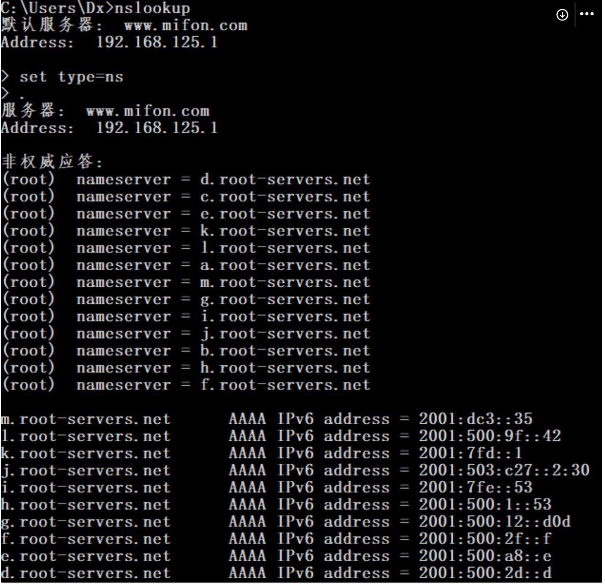
                虽然没有说明，但DNS一般都是用UDP进行传输，在这张图中
                
                只有非权威Non-authoritative的结果，一般为缓存的结果，而不是.com控管的响应服务器返回的结果
                
                一共有13个域名，现在我们知道了域名，还需要得到对应的IP地址才可以进行通话
                
            2. **查询根服务器对应的IP地址**
                
                设置type为a，也就是IPv4，然后随便选一个根服务器 d.root-servers.net得到对应的IP地址
                
                
                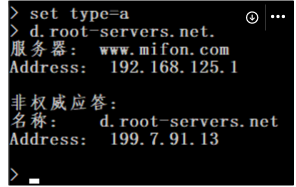
                同样是Non-authoritative的结果，因为根服务器知道com域名服务器的地址
                
            3. **查询com域名服务器的地址**
                
                于是我们再跟刚刚选的d根域名服务器对话，设置type=ns，输入com.，也就是向跟域名服务器查询com域名服务器的地址，得到如下结果
                
                
                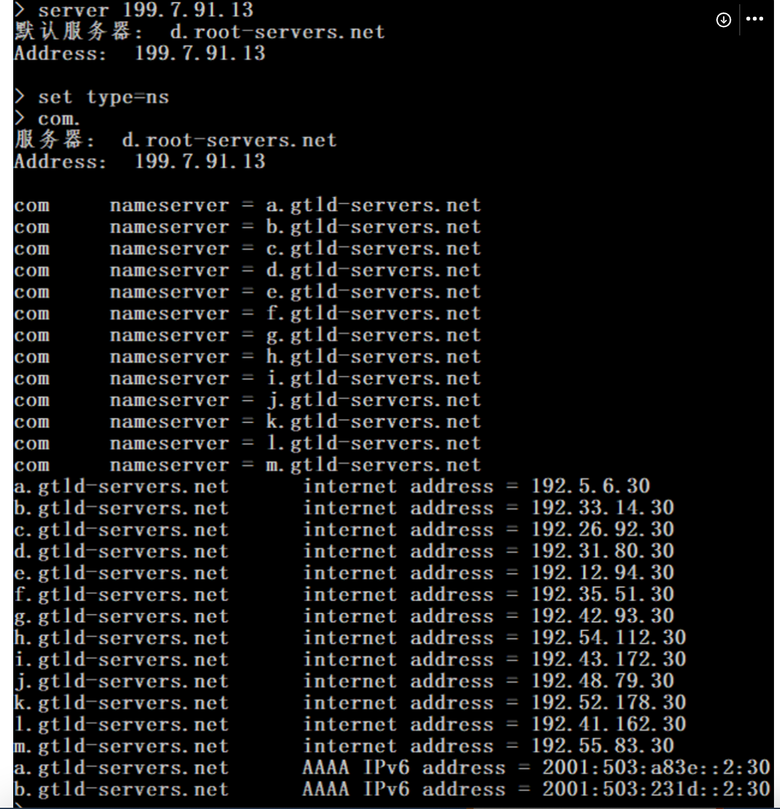
                可以看到这次是com开头的权威Authoritative的结果，上部分com开头的是服务器的域名，下部分是域名对应的IPv4和IPv6地址
                
                注意下部分中的gtld表示genetic top level domain，通用顶级域名，于是顶级域名tld里最常见的一种
                
            4. **查询bilibili.com服务器地址**
                
                再随便选一个com域名服务器的地址 192.31.80.30，直接和这个gtld通话，并设置type为ns，然后像gtld查询bilibili.com域名服务器的地址
                
                
                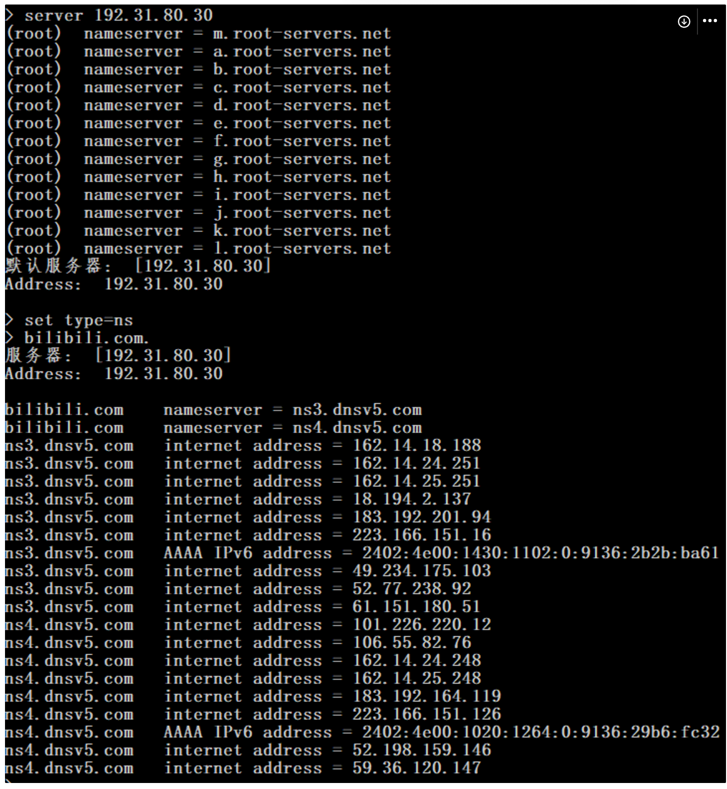
                可以看到bilibili的域名服务器有两个 [ns3.dnsv5.com](http://ns3.dnsv5.com)  和 [ns4.dnsv5.com](http://ns4.dnsv5.com)（这里是由DNSpod提供的），两个域名各自对应多个IP地址
                
            5. **查询www.bilibili.com的IPv4地址**
                
                随便选一个162.14.18.188，与这个IP地址通话，设置type为a，查询www.bilibili.com的域名服务器地址，查看是bilibili.com本身还是canonical name的域名跳转
                
                
                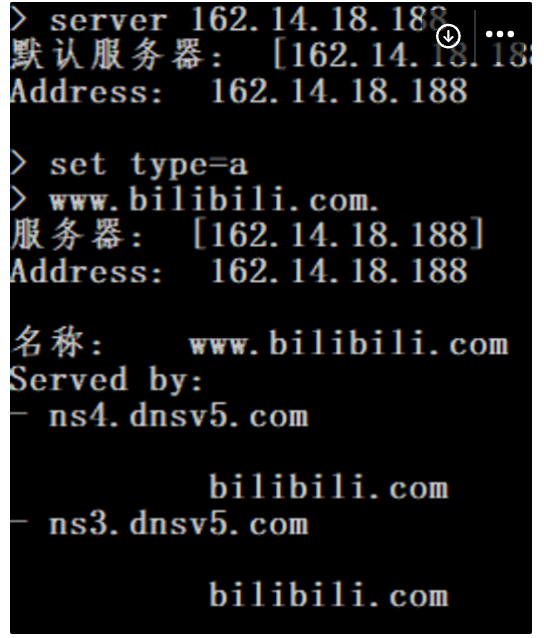
                可以看到域名就是bilibili.com，并没有cdn跳转，输入bilibili.com，即可得到对应的IP地址
                
                
                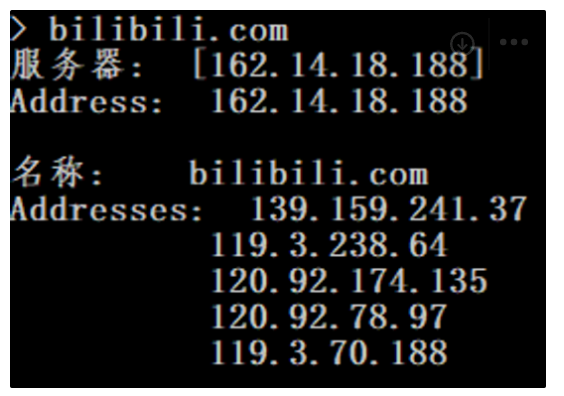
            6. **返回并缓存**
                
                DNS服务器得到IP地址后会返回给解析器，一般还会把地址给缓存起来，解析器再把地址给浏览器，浏览器就可以通过这个IP地址进行网页的连接了
                
            
            注意：解析器和本地DNS服务器用的是递归的方式传输，而本地DNS服务器与三层服务器根域名服务器、com域名服务器、bilibili.com域名服务器是迭代的方式传输
            
            下图为整体流程图：
            
            
            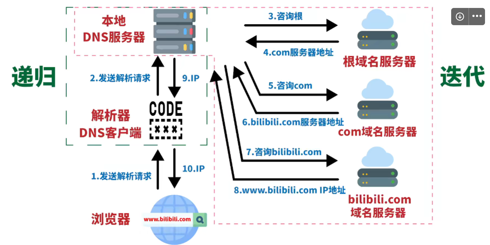
            
- 2. **与服务器建立TCP连接**
    
    TCP与UDP的区别：TCP是基于连接的，UDP是基于非连接的，两者就像打电话和发邮件的区别 @
    
    - **TCP**
        
        以下客户端为A，服务端为B
        
        **三次握手：**
        
        1. A向B发送SYN包请求连接
        2. B同意连接，则回复SYN+ACK包
        3. A收到之后，回复一个ACK包
        
        **注意：**为什么是三次而不是两次？如果是两次的话，A发送SYN包1时可能会因网络阻塞导致B没有收到，此时A会再发送一个SYN包2，当B收到SYN包2后正常连接，之后SYN包1被B收到，又会建立一个新的连接
        
        而这是错误的，因为对A来说是同一个连接，B确以为是两个连接，所以需要三次握手。就好比双排开语音时：A问听得到吗？B回听得到，你听得到我吗？A回听得到
        
        也就是说三次握手是为了防止A已失效的请求报文突然又传输到B引起错误
        
        
        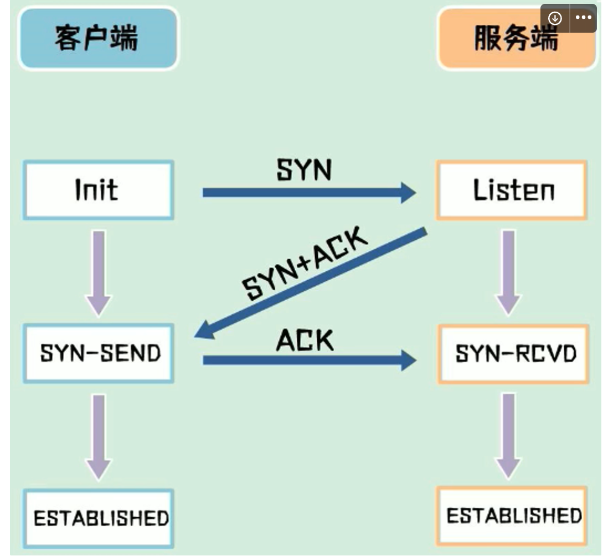
        **数据传输：**
        
        如何处理丢包问题、乱序问题
        
        TCP协议为每一个了连接建立了一个发送缓冲区，从建立连接后的第一个字节的序列号为0，后面的每一个字节的序列号会增加1
        
        1. A发送数据时，从缓冲区中取一部分数据组成**发送报文**，起始序列号+长度+数据内容
        2. B接收数据后，会回复**确认报文**，报文中的ACK=接收序列号+长度，也就是下一包数据的起始序列号
        
        A也可以一次发送连续的多包数据，B只需要回复一次ACK
        
        这样A可以把待发送数据分割成连续的碎片发送，B接收后根据序列号和长度得到完整的数据
        
        假如其中丢失了起始序列号为n的数据，B会发送ACK=n+长度，要求A重发
        
        **注意：**以上过程不区分AB，TCP连接是全双工的，对两端来说都是该机制
        
        
        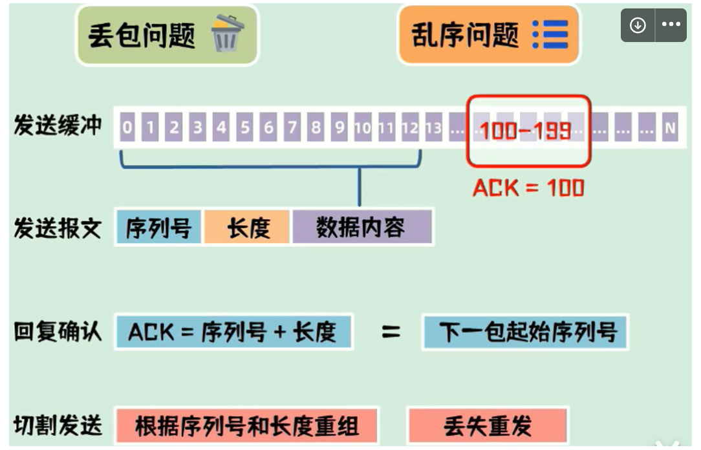
        **四次挥手：**
        
        双端都可以主动关闭连接，以A为例
        
        1. A向B发送一个FIN包，表示要关闭连接，并进入终止等待1状态
        2. B收到后回复ACK包，表示自己进入了关闭等待状态，A收到后进入终止等待2状态，此时B还可以发送数据，A还可以接收数据
        3. B发送完剩余数据后，发送FIN包，进入最后确认状态
        4. A收到后回复ACK包，进入超时等待状态，超时时间结束后关闭连接，而B收到ACK包后立即关闭连接
        
        **注意：**为什么A需要超时等待状态？这是为了保证B已收到ACK包，如果B没有收到ACK包，B则会重发一次的FIN包，A响应后重发ACK包并刷新超时时间
        
        这个机制与三次握手一样，也是为了在不可靠的网络链路中进行可靠的连接断开确认
        
        
        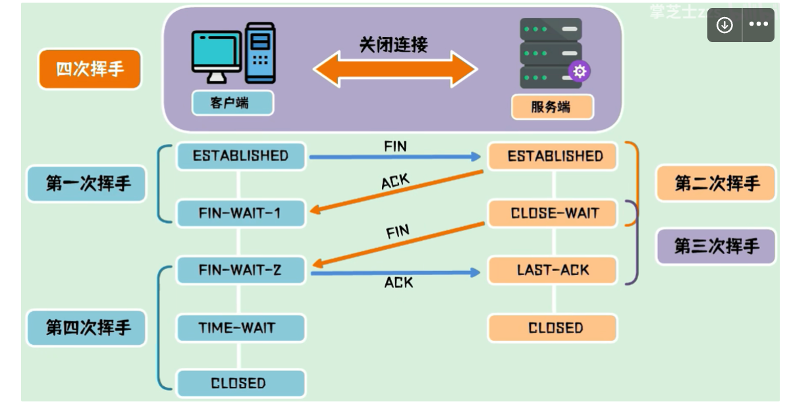
    - **UDP**
        
        UDP协议就是把数据简单封装一下然后从网卡发出去就可以了，是基于非连接的无状态的传输
        
    
    由此可见：
    
    UDP在性能损耗和资源占用上非常小，速度快，但不能保证稳定性，一般应用在域名解析、语音通话、视频直播等，除此之外还有隧道网络比如VPN、SDN中用到的VXLAN
    
    TCP则是稳定可靠，一般应用在文件传输、发送邮件、浏览网页等
    
- 3. **发送HTTP请求**
    
    http与https的区别：https就是在http的基础上加上了TLS/SSL协议来确保数据的安全和完整
    
    http默认端口80，https默认端口443
    
    - **HTTP**
        
        客户端发送请求给服务端，服务端返回响应给客户端
        
        在HTTP中数据被称为资源可以使html文档、图片、普通文本
        
        资源是通过url进行定位的，url有协议、主机、路径、查询参数组成，服务端收到url会解析并返回响应的数据
        
        - 请求报文
            
            请求方式：GET、POST、PUT、DELETE等
            
            资源路径和查询参数
            
            HTTP协议版本
            
            请求头(Request Headers)：包含额外的请求信息来帮助服务器来决定如何响应，比如**Content-Type:** application/x-www-form-urlencoded
            
            请求体(Request Body)：需要发送给服务端的数据，GET中一般为空
            
        - 响应报文
            
            HTTP协议版本
            
            状态码：
            
            1xx  一般信息
            
            2xx  成功响应
            
            3xx  重定向
            
            4xx  客户端错误
            
            5xx  服务端错误
            
            响应头(Response Headers)：与请求头类似，包含额外的响应信息比如告知客户端如何控制缓存和Cookie
            
            响应体(Response Body)：服务端返回的数据
            
        
        HTTP协议是无状态的，如果要记录状态则需要使用cookie和session，详细跳转：[https://www.notion.so/9d4cdf7b7a4244ff81dc5714c4b25e3f](https://www.notion.so/9d4cdf7b7a4244ff81dc5714c4b25e3f?pvs=21)
        
        HTTP2中
        
        数据使用二进制传输
        
        支持多路复用，建立连接后可以一次发送多个HTTP请求
        
        压缩Headers，减少负载
        
        支持Server Push
        
    - **HTTPS**
        
        对称加密：发送方和接收方使用相同的加密解密规则
        
        非对称加密：发送方持有公钥，接收方持有私钥，数据被公钥加密后，需要使用私钥才能解密
        
        SSL证书：需要向CA(Certificate Authority证书授权中心)申请，证书中包括了公钥和私钥
        
        - TLS握手过程
            
            以下客户端为A，服务端为B
            
            1. Client Hello，A生成第一个随机数，把支持的TLS版本和加密套件以及第一个随机数发给B
            2. Server Hello，B生成第二个随机数，把确认使用的TLS版本和加密套件以及第二个随机数发给A
            3. Certificate，如果需要证书，会把证书发送给A
            4. Server Key Exchange，发送公钥给A
            5. Server Hello Done，上述全部发送完毕后告知A
            6. Client Key Exchange，生成第三个随机数（预主密钥），并通过公钥加密后发送给B，注意公钥只能用来加密，解密需要使用服务端才有的私钥，然后B解密后获得预主密钥
            7. A和B通过第一随机数、第二随机数、第三随机数（预主密钥）生成会话密钥，由非对称加密得到的会话密钥，只有AB两者知道
            8. 由于非对称加密性能损耗打，所以得到会话密钥之后当前会话使用该会话密钥进行数据的加解密，也就是对数据进行对称加密
            
            
            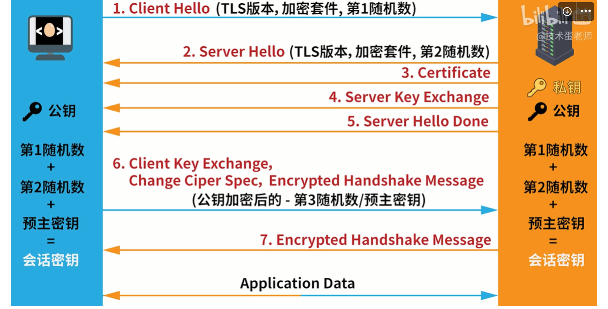
    - **HTTP缓存**
        - 强缓存
            
            可通过cache-control设置
            
            cache-control中max-age字段可设置强缓存时间周期，在该周期内，将直接从缓存中获取资源而不是从服务器中获取
            
        - 协商缓存
            
            通过响应头中的etag和last-modified控制
            
            每次发送请求时需要进行缓存新鲜度校验，如果资源过旧，将直接从响应中获取，否则从缓存中获取
            
            新鲜度校验：对比请求头中的if-none-match和响应头中的etag，或者对比请求头中的if-modified-since和响应头中的last-modified
            
- 4. **服务器返回数据**
    
    上述HTTP中已描述
    
- 5. **浏览器通过获取到的html、css、js等前端文件，渲染页面**
    
    **解析html文件过程：**
    
    1. 解析HTML形成DOM树
    2. 解析CSS形成CSSOM树
    3. 合并DOM数和CSSOM树形成渲染树
    4. 浏览器开始渲染并绘制页面
    
    **回流(重排)**
    
    当渲染树中的尺寸、结构、某些影响布局的属性发生改变时，浏览器重新渲染部分或全部文档的过程称为回流
    
    导致回流的操作：
    
    1. 页面首次渲染
    2. 浏览器窗口大小改变
    3. 元素尺寸、位置或影响尺寸位置的属性或内容发生改变
    4. DOM节点新增或删除
    5. 激活CSS伪类（:hover）
    6. 访问DOM对象某些属性和方法：
        - clientXxx
        - offsetXxx
        - scrollXxx
        - getComputedStyle()、scrollTo()
    
    **重绘**
    
    当页面元素的样式发生改变但不影响在文档流中的位置，比如颜色、透明度等
    
    **优化**
    
    **CSS**
    
    - 注意table布局，因为table布局中元素大小位置变化会引起整体多个元素一起回流
    - 注意CSS表达式如calc()
    - 避免设置多层内联样式 <style></style>
    - 动画和过渡效果尽量应用到脱离文档流的元素上
    
    **js**
    
    - 避免多次修改样式导致多次回流或重绘，写好class的样式更改标签的class
    - 避免频繁操作DOM，使用**[DocumentFragment](https://developer.mozilla.org/zh-CN/docs/Web/API/DocumentFragment)**，或者虚拟DOM
    - 利用display: none先隐藏元素，操作结束后再显示出来
    - js动画也应该应用到脱离文档流的元素上
    
    **JS解析**
    
    JS是单线程运行的，运行时执行栈将任务分为**同步**任务和**异步**任务，同步任务在主线程中按顺序执行，异步任务进入Event Table并注册函数，移入Event Queue，等待主线程中的同步任务执行完后再从Event Queue读取到主线程中执行，往复循环形成Event Loop事件循环
    
    宏任务：script、setTimeout、setInterval
    
    微任务：Promise
    
    主线程执行栈清空 → 微任务 → 宏任务
    

### 跨域

跨域资源共享（CORS，Cross-Origin Resources Sharing）

是浏览器的保护机制，只允许网页访问符合**同源策略**的服务，也就是协议、域名、端口一致

一般多发生在前端本地运行项目访问服务器时

解决方法：配置前端、配置后端、配置服务器、通过jsonp

**jsonp：**只支持get请求，且不适合react和vue开发，且存在安全隐患

**配置后端：**响应头Access-Control-Allow-Origin中，值为*代表允许所有请求，值为域名代表允许指定域名的请求。

在nodejs和express框架中可以添加cors中间件，默认允许所有跨域请求，如果要限制可以传入origin配置项，可以使字符串域名，也可以使字符串域名的数组

```jsx
app.use(cors()) // 默认允许所有跨域请求
// 可传入配置项
app.use(cors({
	// origin: 'http://localhost:3000'
	// 或者
	origin: ['http://localhost:3000', 'http://localhost:8080']
}))
```

**配置前端：**以vite+vue为例，可以在vite.config.js中配置proxy配置项

```jsx
export default defineConfig({
	server: {
		proxy: {
			'/api': {
				target: 'http://localhost:5000',
				changeOrigin: true,
				rewrite: path => path.replace(/^\/api/, '')
			}
		}
	}
})
```

**配置服务器：**在非开发环境或开发服务器不支持代理时，可以手动创建一个中转服务器来代理请求

### 常见的状态码

### 200 成功

请求成功，通常服务器提供了需要的资源。

### 204 无内容

服务器成功处理了请求，但没有返回任何内容。

### 301 永久移动

请求的网页已永久移动到新位置。 服务器返回此响应（对 GET 或 HEAD 请求的响应）时，会自动将请求者转到新位置。

### 302 临时移动

服务器目前从不同位置的网页响应请求，但请求者应继续使用原有位置来进行以后的请求。

### 304 未修改

自从上次请求后，请求的网页未修改过。 服务器返回此响应时，不会返回网页内容。

### 400 错误请求

服务器不理解请求的语法。

### 401 未授权

请求要求身份验证。 对于需要登录的网页，服务器可能返回此响应。

### 403 禁止

服务器拒绝请求。

### 404 未找到

服务器找不到请求的网页。

### 422 无法处理

请求格式正确，但是由于含有语义错误，无法响应

### 500 服务器内部错误

服务器遇到错误，无法完成请求。

## 二、前端工程化

### **Webpack**

1. **Loader**

webpack 默认支持处理 JS 与 JSON 文件，其他类型都处理不了，这里必须借助 Loader 来对不同类型的文件的进行处理

Loader 就是将 Webpack 不认识的内容转化为认识的内容

```jsx
const path = require('path')

module.exports = {
	mode: 'development', // 模式
	entry: './src/index.js' // 入口
	output: {
		filename: 'bundle.js', // 输出文件名
		path: path.join(__dirname, 'dist') // 输出文件目录
	},
	module: {
		rules: [
			{
				test: \/.css$\, // 匹配的文件
				use: 'css-loader' // 使用的loader名称
			}
		]
	}
}
```

1. **Plugin**

与 Loader 用于转换特定类型的文件不同，插件（Plugin）可以贯穿 Webpack 打包的生命周期，执行不同的任务

1. aa

## 三、HTML

### 页面结构语义化

头部header、导航nav、附加侧边栏aside、底部footer（版权、来源信息、法律限制等）

好处：

1. 代码易阅读易维护
2. 无障碍阅读支持
3. 搜索引擎友好，利于SE0
4. 面向未来的HTML，未来可能提供更丰富的支持

### meta标签的作用

1. **meta标签的定义**
    
    ·元数据（metadata）是关于数据的信息。
    
    标签提供关于 HTML 文档的元数据。元数据不会显示在页面上，但是对于机器是可读的。
    
    典型的情况是，meta 元素被用于规定页面的描述、关键词、文档的作者、最后修改时间以及其他元数据。
    
    标签始终位于 head 元素中。
    
    元数据可用于浏览器（如何显示内容或重新加载页面），搜索引擎（关键词），或其他 web 服务。
    
    总结下就是：**`<meta>` 标签提供关于 HTML 文档的元数据。它不会显示在页面上，但是对于机器是可读的。可用于浏览器（如何显示内容或重新加载页面），搜索引擎（关键词），或其他 web 服务。**
    
2. **meta的作用**
    
     meta里的数据是供机器解读的，告诉机器该如何解析这个页面，还有一个用途是可以添加服务器发送到浏览器的http头部内容
    
3. **meta的必需属性和可选属性**
    
    **必需属性content**
    
    meta的必需属性是content，当然并不是说meta标签里一定要有content，而是当有`http-equiv`或`name`属性的时候，一定要有content属性对其进行说明。例如：
    
    `<meta name="keywords" content="HTML,ASP,PHP,SQL">`
    
    这里面content里的属性就是对keywords进行的说明，所以呢也可以理解成一个键值对吧，就是`{keywords:"HTML,ASP,PHP,SQL"}`。
    
    **可选属性**
    
    在W3school中，对于meta的可选属性说到了三个，分别是http-equiv、name和scheme。考虑到scheme不是很常用，所以就只说下前两个属性吧。
    
    ### http-equi
    
    `http-equiv`属性是添加http头部内容，对一些自定义的，或者需要额外添加的http头部内容，需要发送到浏览器中，我们就可以是使用这个属性。在上面的meta作用中也有简单的说明，那么现在再举个例子。例如我们不想使用js来重定向，用http头部内容控制，那么就可以这样控制：
    
    ```
    <meta http-equiv="Refresh" content="5;url=http://blog.yangchen123h.cn" />
    ```
    
    在页面中加入这个后，5秒钟后就会跳转到指定页面啦，
    
    ### name
    
    第二个可选属性是name，这个属性是供浏览器进行解析，对于一些浏览器兼容性问题，name属性是最常用的，当然有个前提就是浏览器能够解析你写进去的name属性才可以，不然就是没有意义的。还是举个例子吧:
    
    ```
    <meta name="renderer" content="webkit">
    ```
    
    这个meta标签的意思就是告诉浏览器，用webkit内核进行解析，当然前提是浏览器有webkit内核才可以，不然就是没有意义的啦。当然看到这个你可能会有疑问，这个renderer是从哪里冒出来的，我要怎么知道呢？这个就是在对应的浏览器的开发文档里就会有表明的。
    
4. **常用meta标签大总结**
    
    ### charset
    
    charset是声明文档使用的字符编码，解决乱码问题主要用的就是它，值得一提的是，这个**charset一定要写第一行**，不然就可能会产生乱码了。
    
    charset有两种写法
    
    ```
    <meta charset="utf-8">
    <meta http-equiv="Content-Type" content="text/html; charset=utf-8">
    ```
    
    两个都是等效的。
    
    ### 百度禁止转码
    
    百度会自动对网页进行转码，这个标签是禁止百度的自动转码
    
    ```
    <meta http-equiv="Cache-Control" content="no-siteapp" />
    ```
    
    ### SEO 优化部分
    
    ```
    <!-- 页面标题<title>标签(head 头部必须) -->
    <title>your title</title>
    <!-- 页面关键词 keywords -->
    <meta name="keywords" content="your keywords">
    <!-- 页面描述内容 description -->
    <meta name="description" content="your description">
    <!-- 定义网页作者 author -->
    <meta name="author" content="author,email address">
    <!-- 定义网页搜索引擎索引方式，robotterms 是一组使用英文逗号「,」分割的值，通常有如下几种取值：none，noindex，nofollow，all，index和follow。 -->
    <meta name="robots" content="index,follow">
    ```
    
    ### viewport
    
    viewport主要是影响移动端页面布局的，例如：
    
    ```
    <meta name="viewport" content="width=device-width, initial-scale=1.0">
    ```
    
    content 参数：
    
    - width viewport 宽度(数值/device-width)
    - height viewport 高度(数值/device-height)
    - initial-scale 初始缩放比例
    - maximum-scale 最大缩放比例
    - minimum-scale 最小缩放比例
    - user-scalable 是否允许用户缩放(yes/no)
5. **各浏览器平台**
    
    **Microsoft Internet Explorer**
    
    ```jsx
    <!-- 优先使用最新的ie版本 -->
    <meta http-equiv="x-ua-compatible" content="ie=edge">
    <!-- 是否开启cleartype显示效果 -->
    <meta http-equiv="cleartype" content="on">
    <meta name="skype_toolbar" content="skype_toolbar_parser_compatible">
    
    <!-- Pinned Site -->
    <!-- IE 10 / Windows 8 -->
    <meta name="msapplication-TileImage" content="pinned-tile-144.png">
    <meta name="msapplication-TileColor" content="#009900">
    <!-- IE 11 / Windows 9.1 -->
    <meta name="msapplication-config" content="ieconfig.xml">
    ```
    
    **Google Chrome**
    
    ```jsx
    <!-- 优先使用最新的chrome版本 -->
    <meta http-equiv="X-UA-Compatible" content="chrome=1" />
    <!-- 禁止自动翻译 -->
    <meta name="google" value="notranslate">
    ```
    
    **360浏览器**
    
    ```jsx
    
    <!-- 选择使用的浏览器解析内核 -->
    <meta name="renderer" content="webkit|ie-comp|ie-stand">
    ```
    
    **UC手机浏览器**
    
    ```jsx
    <!-- 将屏幕锁定在特定的方向 -->
    <meta name="screen-orientation" content="landscape/portrait">
    <!-- 全屏显示页面 -->
    <meta name="full-screen" content="yes">
    <!-- 强制图片显示，即使是"text mode" -->
    <meta name="imagemode" content="force">
    <!-- 应用模式，默认将全屏，禁止长按菜单，禁止手势，标准排版，强制图片显示。 -->
    <meta name="browsermode" content="application">
    <!-- 禁止夜间模式显示 -->
    <meta name="nightmode" content="disable">
    <!-- 使用适屏模式显示 -->
    <meta name="layoutmode" content="fitscreen">
    <!-- 当页面有太多文字时禁止缩放 -->
    <meta name="wap-font-scale" content="no">
    ```
    
    **QQ手机浏览器**
    
    ```jsx
    <!-- 锁定屏幕在特定方向 -->
    <meta name="x5-orientation" content="landscape/portrait">
    <!-- 全屏显示 -->
    <meta name="x5-fullscreen" content="true">
    <!-- 页面将以应用模式显示 -->
    <meta name="x5-page-mode" content="app">
    ```
    
    **Apple iOS**
    
    ```jsx
    <!-- Smart App Banner -->
    <meta name="apple-itunes-app" content="app-id=APP_ID,affiliate-data=AFFILIATE_ID,app-argument=SOME_TEXT">
    
    <!-- 禁止自动探测并格式化手机号码 -->
    <meta name="format-detection" content="telephone=no">
    
    <!-- Add to Home Screen添加到主屏 -->
    <!-- 是否启用 WebApp 全屏模式 -->
    <meta name="apple-mobile-web-app-capable" content="yes">
    <!-- 设置状态栏的背景颜色,只有在 “apple-mobile-web-app-capable” content=”yes” 时生效 -->
    <meta name="apple-mobile-web-app-status-bar-style" content="black">
    <!-- 添加到主屏后的标题 -->
    <meta name="apple-mobile-web-app-title" content="App Title">
    ```
    
    **Google Android**
    
    ```jsx
    <meta name="theme-color" content="#E64545">
    <!-- 添加到主屏 -->
    <meta name="mobile-web-app-capable" content="yes">
    <!-- More info: https://developer.chrome.com/multidevice/android/installtohomescreen -->
    ```
    
    **App Links**
    
    ```jsx
    <!-- iOS -->
    <meta property="al:ios:url" content="applinks://docs">
    <meta property="al:ios:app_store_id" content="12345">
    <meta property="al:ios:app_name" content="App Links">
    <!-- Android -->
    <meta property="al:android:url" content="applinks://docs">
    <meta property="al:android:app_name" content="App Links">
    <meta property="al:android:package" content="org.applinks">
    <!-- Web Fallback -->
    <meta property="al:web:url" content="http://applinks.org/documentation">
    <!-- More info: http://applinks.org/documentation/ -->
    ```
    
    **最后——移动端常用的meta**
    
    ```jsx
    <meta name="viewport" content="width=device-width, initial-scale=1, user-scalable=no" />
    <meta name="apple-mobile-web-app-capable" content="yes" />
    <meta name="apple-mobile-web-app-status-bar-style" content="black" />
    <meta name="format-detection"content="telephone=no, email=no" />
    <meta name="viewport" content="width=device-width, initial-scale=1, user-scalable=no" />
    <meta name="apple-mobile-web-app-capable" content="yes" /><!-- 删除苹果默认的工具栏和菜单栏 -->
    <meta name="apple-mobile-web-app-status-bar-style" content="black" /><!-- 设置苹果工具栏颜色 -->
    <meta name="format-detection" content="telphone=no, email=no" /><!-- 忽略页面中的数字识别为电话，忽略email识别 -->
    <!-- 启用360浏览器的极速模式(webkit) -->
    <meta name="renderer" content="webkit">
    <!-- 避免IE使用兼容模式 -->
    <meta http-equiv="X-UA-Compatible" content="IE=edge">
    <!-- 针对手持设备优化，主要是针对一些老的不识别viewport的浏览器，比如黑莓 -->
    <meta name="HandheldFriendly" content="true">
    <!-- 微软的老式浏览器 -->
    <meta name="MobileOptimized" content="320">
    <!-- uc强制竖屏 -->
    <meta name="screen-orientation" content="portrait">
    <!-- QQ强制竖屏 -->
    <meta name="x5-orientation" content="portrait">
    <!-- UC强制全屏 -->
    <meta name="full-screen" content="yes">
    <!-- QQ强制全屏 -->
    <meta name="x5-fullscreen" content="true">
    <!-- UC应用模式 -->
    <meta name="browsermode" content="application">
    <!-- QQ应用模式 -->
    <meta name="x5-page-mode" content="app">
    <!-- windows phone 点击无高光 -->
    <meta name="msapplication-tap-highlight" content="no">
    <!-- 适应移动端end -->
    ```
    

## 四、CSS

### 标准盒模型

标准盒模型：**实际宽度** = **设置的宽度**(content) + **border** + **padding** + **margin**

低版本IE： **实际宽度** = **设置的宽度**(content + border + padding) + **margin**

可使用box-sizing控制盒子模型解析模式，默认content-box，设置为border-box为IE传统盒模型

### 选择器

### BFC

BFC规定了内部的块级元素布局

1. 垂直方向上一个接一个放置
2. BFC是一个隔离的容器，容器里的元素不会影响外面的元素（清除外边距重叠的原理）
3. 垂直方向的margin是同一个BFC中相邻元素的最大margin
4. 每个元素的margin靠左上与父级padding接触
5. BFC的区域不会与之后的float元素重叠
6. 计算BFC高度时浮动元素也会计算（清除浮动的原理）

应用：

- 避免外边距重叠：两个上下排列的div外边距会重叠，给两个div生成不同的BFC即可，比如套一个`overflow: hidden`的父盒子
- 清除浮动：仅包含浮动元素的父盒子高度不会自动撑开，给父盒子设置`overflow: hidden`或`clear: both`可正常撑开高度

## 五、JS

### 数据类型

值(基础)类型：string、number、boolean、undefined、null、symbol、bigint

引用(复杂)类型：object、array、function、set、map等

类型判断：[typeof](https://developer.mozilla.org/zh-CN/docs/Web/JavaScript/Reference/Operators/typeof)操作符、[instanceof](https://developer.mozilla.org/zh-CN/docs/Web/JavaScript/Reference/Operators/instanceof)运算符、[toString](https://developer.mozilla.org/zh-CN/docs/Web/JavaScript/Reference/Global_Objects/Object/toString)方法、[constructor](https://developer.mozilla.org/zh-CN/docs/Glossary/Constructor)属性

- typeof和instanceof区别
    
    typeof返回基本类型和”function”，任何对象包括null返回”object”
    
    instanceof检测运算符左侧的原型链上是否有右边的原型(prototype属性)
    
- toString检测类型
    
    必须使用 `Object.prototype.toString.call()` 的形式调用，返回 [object rawType]
    
- constructor
    
    若`A.constructor === B` 为 true，说明A是通过`new B()`得到的实例对象
    

### 闭包

闭包是一个函数，该函数的返回值可能包含对声明时作用域（词法作用域）中变量的引用

```jsx
function test() {
	const num = 1
	return () => num
}
const getNum = test() // getNum就是一个闭包，调用他可以拿到内部变量当时的值
const num = getNum() // 1
```

作用：延长局部变量生命周期、扩大局部变量使用范围、贮藏某一时刻的值等

缺点：可能带来内存泄漏（有时候局部变量无法垃圾回收，手动将不使用的局部变量全部删除）、闭包可能在外部改变内部变量的值

### 垃圾回收机制

一般来说没有被引用的对象，或几个对象引用形成闭环，但没有访问他们的引用，都会被当做垃圾回收

```jsx
// 例1
let person = { name: 'dx' }
person = null // { name: 'dx' } 会被当做垃圾回收

// 例2
function merge(a, b) {
	a.b = b
	b.a = a
	return {
		a,
		b
	}
}
let obj = merge({ name: 'a' }, { name: 'b' })
// 此时obj.a和obj.b.a是同一个引用，obj.b和obj.a.b是同一个引用，obj也是一个引用
obj = null
// 此时虽然 { name: 'a' } 和 { name: 'b' } 还被merge函数返回的这个对象引用，但没有了访问的根
// 对象{ a: { name: 'a' }, b: { name:'b' } }、{ name: 'a' }、{ name: 'b' }会被当做垃圾回收
```

基本垃圾回收算法“标记-清除”：

1. 获取访问的根并标记这些值
2. 访问并标记所有这些值的引用
3. 被访问标记的了值不会再访问第二次
4. 没有被标记的对象就会在内存中被清除

### Promise

Promise是一个执行异步的函数，他的出现是为了解决回调地狱的问题，因为有了resolve和reject可以进行异步处理并且得知任务进度

- 基于class手写Promise
    
    注意点：
    
    1. 基本结构
    2. this指向
    3. then、catch、finally
    4. 执行异常
    5. 异步
    6. 回调保存（状态保存）
    7. 链式调用
    - [ ]  佳哥（写完后demo地址链接到此处）
    - [ ]  雄哥（写完后demo地址链接到此处）

### ajax、axios、fetch

原生ajax是指通过XHR(**[XMLHttpRequest](https://developer.mozilla.org/zh-CN/docs/Web/API/XMLHttpRequest)**)对象实现在不刷新页面的情况下异步获取到数据

- **ajax**
    
    如今的ajax更多指的是jquery中封装的ajax方法，默认数据提交是表单形式
    
- **axios**
    
    axios也是基于xhr对象封装的方法，优点与jq中的ajax使用基本一样，而且在前后端中都是同一种使用方法，学习成本低，倾向于**推荐**。默认数据提交是json形式
    
- **[fetch](https://developer.mozilla.org/zh-CN/docs/Web/API/Fetch_API)**
    
    浏览器环境自带的API，使用上稍微有点不同，返回的是一个promise封装的对象，通过res.json()拿到值，这个值还是promise对象，存在IE浏览器兼容问题
    
    ```jsx
    // 基本使用
    fetch(url)
    	.then(res => res.json())
    	.then(data => console.log(data))
    ```
    

### let和var区别

- let一般没有变量提升
- 由于暂存死区，可以认为在块级作用域中存在变量提升，定义前访问会报错，注意这个报错并不是is not defined

```tsx
{
	a
	let a = 1
}
// > Uncaught ReferenceError: Cannot access 'a' before initialization
```

- 全局作用域中var变量会挂载到window对象上，let不会

### forEach和for区别

- forEach会产生一个迭代器，无法控制迭代开始的索引，无法控制每次迭代的递增，无法正常跳出循环，continue和break报错，return无效果，如果要跳出循环应使用try catch
- for可以通过let i = a控制开始索引和结束条件，通过i+=b控制迭代的递增，可正常跳出循环
- forEach的无论是内存占用还是执行速度上都不如for

### 字符串slice、substr、substring区别

substr包括结尾位置的字符，官方已废弃，不推荐使用，未来可能会删除

slice和substring不包括结尾位置的字符

slice也可以用于数组，第二个参数可以为负数，负数表示倒数第几个

## 六、框架

### VUE

### Vue路由守卫

1. 路由守卫分为以下几种：
    
    全局守卫：beforeEach（是路由的钩子函数，在每一个路由跳转之前执行，常做登录权限判断，参数：to，from，next）
    后置守卫：afterEach（在跳转之后执行，参数：to，from）
    全局解析守卫：beforeResolve（参数：to，from，next。在beforeEach之后，afterEach之前）
    路由独享守卫：beforeEnter
    组内路由守卫：beforeRouteEnter，beforeRouteUpdate，beforeRouteLeave
    
2. to：Route – 即将要进入的目标 路由对象
from：Route – 当前导航正要离开的路由
next：Function – 一定要调用该方法来resolve这个狗子。执行效果依赖next方法的调用参数
next参数 --↓
next（） // 直接进to所指路由
next（false）//中断当前路由
next（‘route’）//跳转指定路由
next（‘error’）//跳转错误路由
3. beforeResolve
router.beforeEach类似，区别是在导航被确认之前，同时在所有组件内守卫和异步路由组件被解析之后，解析守卫就被调用
4. beforeRouteLeave
离开该组件时调用
可以访问this
通常用来禁止用户在还未保存修改前突然离开。该导航可以通过 next(false) 来取消
5. beforeRouteUpdate
路由形态参数改变，组件被复用时调用（/user/1 => 1/user/2）
6. 路由导航解析流程
路由导航开始
在当前路由调用beforeRouteLeave
调用beforeEach
在重用组建中调用beforeRouteUpdate
调用beforeEnter
解析异步路由组件
在被激活的路由组件里调用beforeRouteEnter
调用beforeResolve
导航被确认
调用全局的afterEach
触发DOM更新

### Vue兼容IE

**注意：**

1. vue 只兼容ie8以上版本；
2. IE 不兼容 axios的promiss对象;
3. IE 不兼容es6语法；
4. ES6转ES5

**一、关于babel-polyfill**

1、说明：若在项目中使用了ES6 promise对象，它在Chrome、Safari浏览器下可以正常运行，但在360兼容模式、IE内核中不支持；

2、安装：npm install es6-promise；

3、配置：在main.js中加入require('es6-promise').polyfill()，用于在node或浏览器中支持ES6 与CommonJS。

1、index引入这句话或者这三句话


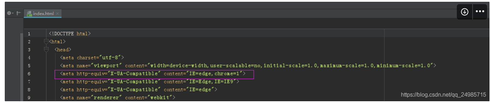
npm install --save babel-polyfill；执行完上面语句package.json里面就有了这个依赖

### Vue3响应式源码解析

> vue3核心源码地址：https://github.com/vuejs/core
> 

此次源码分析对应版本为3.2.25 日期为2022.1.23

## 一、reactive

源码文件路径：packages\reactivity\src\reactive.ts

过程：

1. 如果被readonly处理过，直接返回该数据，因为被readonly处理过也是Proxy对象否则对该数据创建响应式对象
2. 如果该数据不是对象类型 直接返回该数据
3. 如果该数据是响应式对象 除非是用readonly处理过的响应式对象 直接返回该对象，这里说明响应式对象也可以用readonly方法再次处理
4. 如果可以在Map中找到该对象（被处理过的响应式对象会存入一个Map中） 直接返回该对象
5. 如果该对象不可扩展或被标记为跳过 直接返回该对象，说明被preventExtensions、seal、freeze处理过的对象不能成为响应式
6. 使用 new Proxy 创建响应式对象
7. 原对象作为key，响应式对象作为value加入到对应Map中保存

### 一些需要注意的点

### 1. [WeakMap](https://developer.mozilla.org/zh-CN/docs/Web/JavaScript/Reference/Global_Objects/WeakMap) 和 [Map](https://file+.vscode-resource.vscode-webview.net/c%3A/Users/Dx/Desktop/(https://developer.mozilla.org/zh-CN/docs/Web/JavaScript/Reference/Global_Objects/Map)) 的区别

WeakMap 的 key 只能是对象且不可枚举，key对value是弱引用，可正确的被垃圾回收机制回收

Map 的 key 可以是任意类型，除非使用clear，否则key会一直作为被引用的存在

### 2. [isExtensible](https://developer.mozilla.org/zh-CN/docs/Web/JavaScript/Reference/Global_Objects/Object/isExtensible) 函数判断对象是否可扩展

preventExtensions、seal、freeze 方法都可以标记一个对象为不可扩展

[preventExtensions](https://developer.mozilla.org/zh-CN/docs/Web/JavaScript/Reference/Global_Objects/Object/preventExtensions)：使对象不能添加新属性

[seal](https://developer.mozilla.org/zh-CN/docs/Web/JavaScript/Reference/Global_Objects/Object/seal)：使对象不能添加新属性且不能删除已有属性

[freeze](https://developer.mozilla.org/zh-CN/docs/Web/JavaScript/Reference/Global_Objects/Object/freeze)：使对象不能添加新属性且不能删除已有属性且不能修改已有属性值

### 3. [toString](https://developer.mozilla.org/zh-CN/docs/Web/JavaScript/Reference/Global_Objects/Object/toString) 检测类型

源码文件路径：packages\shared\src\index.ts

需要用call或apply调用，返回 [object RawType]

```tsx
export const toTypeString = (value: unknown): string =>
  objectToString.call(value)

export const toRawType = (value: unknown): string => {
// extract "RawType" from strings like "[object RawType]"return toTypeString(value).slice(8, -1)
}

```

## 二、Proxy处理对象

当判断该数据可以被[Proxy](https://file+.vscode-resource.vscode-webview.net/c%3A/Users/Dx/Desktop/(https://developer.mozilla.org/zh-CN/docs/Web/JavaScript/Reference/Global_Objects/Proxy))处理后，传入一个handler对其处理

注意：下面是非集合（非Set、Map）类型对象的handler中get、set方法详解

### ProxyHandler.get

源码文件路径：packages\reactivity\src\baseHandlers.ts

过程：

1. 如果访问的属性key是否一些标记（与isReactive、isReadonly、isShallow、toRaw有关）则返回对应结果，这些结果不需要关心，是vue中的API所用到的，我们使用对应API即可，下面会提到
2. 如果是数组，会将一些数组方法做对应处理，保证用户对Proxy对象进行数组操作时跟操作数组一样，并对部分方法加入一些响应式更新视图的逻辑，让用户操作数组时也会响应式更新视图
3. 使用Reflect.get获取到对应value
4. 如果是一些内置的Symbol或者__proto__、__v_isRef、__isVue这些类似内置的属性 直接返回对应value
5. 如果是浅监视（shallow） 直接返回对应value
6. 如果不是被readonly处理过的 则添加响应式更新视图逻辑，因为只读数据不能修改，也就没有必要响应式更新视图
7. 如果是该value是ref且原对象不是数组，会直接返回value.value，而不是ref对象，因为ref对象要通过 .value取值但如果是数组的话，通过下标访问数组元素，还是返回的还是ref对象

```tsx
const reactiveObj = reactive({ age: ref(0) })
const reactiveArr = reactive([ref(0)])
console.log(reactiveObj.age)// 0console.log(reactiveArr[0].value)// 0

```

1. 如果该value是对象且原对象不是readonly的，则执行 `reactive(value)` 再次对其进行Proxy处理

我们来验证一下上述过程中的第一条，有关源码如下：

```tsx
/*
  vue用到的一些key，应避免使用这些key作为reactive对象的属性
  否则会使isReactive、isReadonly、toRaw 等方法失效
*/export const enum ReactiveFlags {
  SKIP = '__v_skip',
  IS_REACTIVE = '__v_isReactive',
  IS_READONLY = '__v_isReadonly',
  IS_SHALLOW = '__v_isShallow',
  RAW = '__v_raw'
}

/*
 以非集合响应式对象为例
 proxy的handler的get中第一个过程：
*/if (key === ReactiveFlags.IS_REACTIVE) {
  return !isReadonly
} else if (key === ReactiveFlags.IS_READONLY) {
  return isReadonly
} else if (key === ReactiveFlags.IS_SHALLOW) {
  return shallow
} else if (
  key === ReactiveFlags.RAW &&
  receiver ===
    (isReadonly
      ? shallow
        ? shallowReadonlyMap
        : readonlyMap
      : shallow
      ? shallowReactiveMap
      : reactiveMap
    ).get(target)
) {
  return target
}

```

为了验证上述四种 `if` 分支，可以像如下这样访问

注意：在ts中这种写法会在编译前报错，因为ts会检测reactive函数的返回值类型，不允许访问类型中没有的属性，但依然可以运行

```tsx
<script setup lang="ts">
import { reactive } from 'vue'

interface Person {
  name: string
  age: number
}

// debuggerconst state = reactive<Person>({ name: 'dx', age: 23 })
console.log(
  state.name// 'dx'
  state.__v_isReactive,// ture
  state.__v_isReadonly,// false
  state.__v_isShallow,// false
  state.__v_raw// { name: 'dx', age: 23 }
)
</script>

```

这些访问方法vue也暴露了出来，应正确使用：

```tsx
console.log(
  isReactive(state),// true
  isReadonly(state),// false
  isShallow(state),// false
  toRaw(state)// { name: 'dx', age: 23 }
)

```

### ProxyHandler.set

源码文件路径：packages\reactivity\src\baseHandlers.ts

过程：

1. 通过key获取oldValue
2. 如果不是数组，oldValue是ref对象，value不是ref对象，会对oldValue.value赋值（也就是尤雨溪说的包装和解包装），不需要我们太麻烦的赋值，否则代码多可能会混乱，记不清哪个属性用 .value

```tsx
const reactiveObj = reactive({ age: ref(0) })
reactiveObj.age = 1
```

1. 使用Reflect.set设置对应属性值
2. 如果对象是原型链上的，不触发更新视图的操作 否则更新视图（暂时没有找到合适场景的例子）

## 三、ref

源码文件路径：packages\reactivity\src\ref.ts

过程：

1. 如果已经是ref对象 直接返回对应value

```tsx
// 判断方法用到的key在reactive也有用到export function isRef<T>(r: Ref<T> | unknown): r is Ref<T>;
export function isRef(r: any): r is Ref {
  return Boolean(r && r.__v_isRef === true)
}

```

1. new生成RefImpl类的实例并将其返回

### RefImpl

构造函数中将通过toRaw获取到原数据、toReactive获取到响应式数据（如果是对象的话） 并保存起来

```tsx
constructor(value: T, public readonly __v_isShallow: boolean) {
  this._rawValue = __v_isShallow ? value : toRaw(value)
  this._value = __v_isShallow ? value : toReactive(value)
}

```

起初我心想，当我们使用ref函数创建声明变量时，为什么要对其进行toRaw呢

```tsx
const countRef = ref({})
console.log(countRef)// RefImpl {...}// 此时进入到构造函数中的value并不是响应式对象 只是普通的 {}

```

后来发现，因为有可能将ref对象作为reactive对象中的属性去用，此时就会被Proxy处理

```tsx
const reactiveData = reactive({ count: countRef })
console.log(reactiveData)// Proxy {count: RefImpl}console.log(reactiveData.count)// Proxy {}

```

当通过 .value取值时进入的是类中的get方法返回构造函数中通过toReactive获取到响应式数据，并进行追踪追踪说明当我们声明一个简单类型的ref对象时，并不会被vue追踪，而且被使用时才会被追踪

```tsx
get value() {
  trackRefValue(this)
  return this._value
}

```

当对 .value进行赋值操作时进入到set方法，set中的toRaw也是一个道理

```tsx
set value(newVal) {
  newVal = this.__v_isShallow ? newVal : toRaw(newVal)
  if (hasChanged(newVal, this._rawValue)) {
    this._rawValue = newVal
    this._value = this.__v_isShallow ? newVal : toReactive(newVal)
    triggerRefValue(this, newVal)
  }
}

```

需要注意的是，`this._rawValue` 是存储原数据，在set中通过对比newVal来判断是否修改，如果值没有变化就不会再进行操作如果是浅监视 `this.__v_isShallow` 为ture, 就不需要这些处理，只需追踪这一个值的变化

## 四、computed

源码文件路径：packages\reactivity\src\computed.ts

过程：

1. 判断第一个是否为函数 是则作为getter 否则就是对象options，并将options对象中的get、set作为getter、setter对应computed的两种用法，第一个参数传一个函数作为getter或者第一个参数传一个对象，对象里的get、set作为getter、setter
2. new生成ComputedRefImpl类的实例
3. 如果传了第二个参数，则在开发环境中把第二个参数中的onTrack、onTrigger挂载到该计算属性上

```tsx
if (__DEV__ && debugOptions && !isSSR) {
  cRef.effect.onTrack = debugOptions.onTrack
  cRef.effect.onTrigger = debugOptions.onTrigger
}
```

注意：computed的第二个参数是3.2.x新增的debuggerOptions，该参数类型如下

```tsx
export interface DebuggerOptions {
  onTrack?: (event: DebuggerEvent) => void
  onTrigger?: (event: DebuggerEvent) => void
}
```

### ComputedRefImpl

构造函数中：

1. 判断传入的第三个参数决定该计算属性是否是只读的，第三个参数就是有没有setter
2. 第四个参数isSSR跟服务端渲染以及缓存有关

```
const cRef = new ComputedRefImpl(getter, setter, onlyGetter || !setter, isSSR)

```

1. 使用ReactiveEffect，使获得的计算属性具有响应式

类中一些成员变量的作用`public readonly __v_isRef = true`，说明计算属性也是ref对象`public _dirty = true`，这个值在调用get后置为false，在这个值为true时才会更新，说明当computed依赖的变量发生变化时，并不会马上更新computed值，而是调用get时更新，非常节约性能！

## 五、watch和watchEffect

源码文件路径：packages\runtime-core\src\apiWatch.ts

watch和watchEffect在对参数做一些判断处理后都是调用的同一个叫doWatch的方法，所以把他们放在一起讲

### watch

watch中一共重载了四个类型定义：侦听多个数据源、侦听多个只读数据源、侦听单个数据源、侦听响应式对象。在开发环境中如果第二个参数不是函数，控制台会warn提示，传入对应参数调用doWatch

### watchEffect

watchEffect中直接调用了doWatch，需要注意的是第二个参数options可以设置flush为`'post'`、`'sync'`、`'re'`

```tsx
export interface WatchOptionsBase extends DebuggerOptions {
  flush?: 'pre' | 'post' | 'sync'
}

```

在3.2+中新增了两个API，watchPostEffect和watchSyncEffect，对应就是watchEffect带了`{flush: 'post'}`和`{flush: 'sync'}`参数

### doWatch

过程：

1. 分别对第一个参数是ref对象、reactive对象、Array、Function做不同的处理来获取数据源：ref对象时getter返回source.valuereactive对象时返回sourceArray时getter返回被单个情况处理后的数组 Function时，分别对watch和watchEffect进入的doWatch做不同处理
2. 如果有第二个参数cb，说明是从watch进入的doWatch，判断options中的deep为true时会遍历所有对象中的响应式对象
3. 对options中的flush参数三个值分别做处理，通过一个调度函数让watch/watchEffect在对应的时机去执行回调
4. 初次执行doWatch，对于watchEffect会根据flush参数来执行追踪，对于watch根据immediate参数是否执行追踪
5. 返回一个函数，函数体中会停止对这些数据源追踪，说明我们可以通过调用watch/watchEffect函数返回值去停止侦听

```tsx
// vue源码return () => {
  effect.stop()
  if (instance && instance.scope) {
    remove(instance.scope.effects!, effect)
  }
}

// 使用const stopWatch = watch(source, callback, options)
stopWatch()
```

其中涉及到很多重要且复杂的函数：

1. `job: SchedulerJob`，与watch中获取数据源相关、watchEffect中执行回调有关
2. `scheduler: EffectScheduler`，调用函数，让job在合适的时机去执行
3. `ReactiveEffect`，侦听函数用到的一系列响应式操作对象的类，通过他可以巧妙的和响应式数据联系到一起

三者关系为：job函数被scheduler调度函数包装后通过`new ReactiveEffect()`生成一个effect，effect对象上的函数对应获取数据源、执行传入的回调、停止侦听

### job: SchedulerJob

函数体流程：

1. 如果当前watch已被停止则直接返回
2. 当有cb参数时（watch进入），执行传入的回调获得数据源并赋值给newValue如果deep为true、数据源为reactive对象、简单类型ref对象、数组类型中有元素发生变化的情况下，会异步的循环执行传入的回调函数
3. 没有cb参数时，是watchEffect，直接执行回调函数

### scheduler: EffectScheduler

1. flush为'sync'时，`schedubler = job`
2. flush为'post'时，把job加入到postFlush执行队列，如果组件suspense，会把组件异步执行的操作一并加入到队列中
3. flush为'pre'时，如果此时组件未挂载或mouted完毕，把job加入到pre执行队列，使job在组件下一次beforeUpdate之前调用，否则直接执行一次job

### ReactiveEffect

这个类做了很多关于effect的deps（数据执行保护）构造函数：把实例effect记录到当前响应式链的中run:

1. 如果effect被停止过，则直接执行传入的回调并返回
2. 如果effect栈为空或没有这个effect，则会执行传入的回调并返回，并对effect栈做一些限制处理，防止追踪链太深影响整个项目 stop：停止追踪并在deps中清除这个effect，将active属性置为false，标记为被停止过

---

**注意：当job执行到我们包含响应式对象的语句时，就会进入到Proxy代理后的get方法中，就会进入到track函数并触发trigger函数，watch/watchEffec就是这样把响应式连接起来，下面讲解追踪原理（前面几个响应式对象中也包括的有，之前略过了）**

## 六、track

源码文件路径：packages\reactivity\src\effect.ts

## 七、算法

### JS实现单链表

链表中的数据在内存中的存储是不连续的，一个节点由数据块和next指针构成，next指针指向下一个节点，依次相连形成链表 @

[【动画演示】链表详解及其底层机制 C语言_哔哩哔哩_bilibili](https://www.bilibili.com/video/BV1S64y1W7u5?from=search&seid=4484559639828475115&spm_id_from=333.337.0.0)

v

与数组的区别：

- 数组中的元素是连续存储的，访问其中的元素更加快速方便，但在做插入或删除操作时会影响其后面的所有元素
- 链表中的元素是不连续存储的，访问其中的元素需要从头结点开始遍历，但在做插入或删除操作时只需改变next指针指向，不会影响不相邻的元素
- 对于一类数据，如果需要频繁做插入删除操作多采用链表，如果需要频繁访问元素选用数组

注意点：

- 增删改查清空功能
- 注意内存泄漏

```jsx
class Node {

}

class LinkList {

}
```

### 哈希表法简化查询数组元素的算法

```jsx
// 给定一个整数数组 nums 和一个整数目标值 target，找出和为目标值 target 的那两个整数，并返回它们的数组下标。
// 每种输入只会对应一个答案。但数组中同一个元素在答案里不能重复出现。
// 可以按任意顺序返回答案。

// 示例 1：
// 输入：nums = [2,7,11,15], target = 9
// 输出：[0,1]
// 解释：因为 nums[0] + nums[1] == 9 ，返回 [0, 1]

// 示例 2：
// 输入：nums = [3,2,4], target = 6
// 输出：[1,2]

// 示例 3：
// 输入：nums = [3,3], target = 6
// 输出：[0,1]

// 暴力法
// 双重遍历查找符合条件的两个元素的下标
// 时间复杂度 O(n^2)
const twoSum = (nums, target) => {
  for (let i = 0; i < nums.length - 1; i++) {
    for (let j = i + 1; j < nums.length; j++) {
      if (nums[j] === target - nums[i]) {
        return [i, j]
      }
    }
  }
  return false
}

// 哈希表法
// 生成一个映射（如果key可以是字符串就是普通对象，如果key为复杂类型可以使用Map类型），查询时无需遍历，相比遍历数组一个是O(1)一个是O(n)
// 时间复杂度 O(n)
const twoSum = (nums, target) => {
  const map = nums.reduce((map, item, index) => {
    map[item] = index
    return map
  }, {})
  for (let i = 0; i < nums.length - 1; i++) {
    const j = map[target - nums[i]]
    if (j !== undefined && j !== i) {
      return [i, j]
    }
  }
  return false
}
```